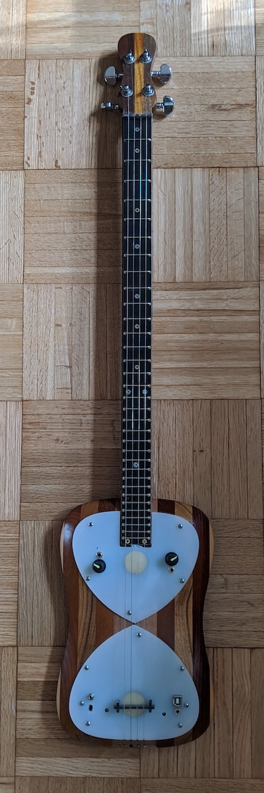
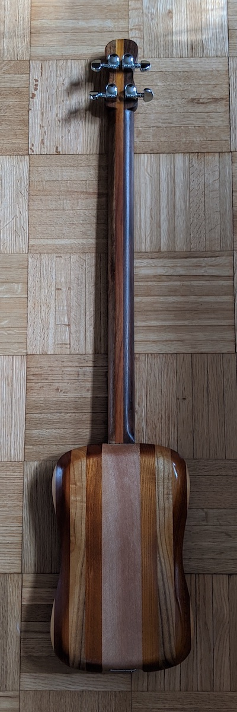
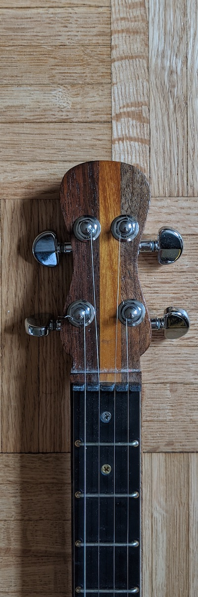
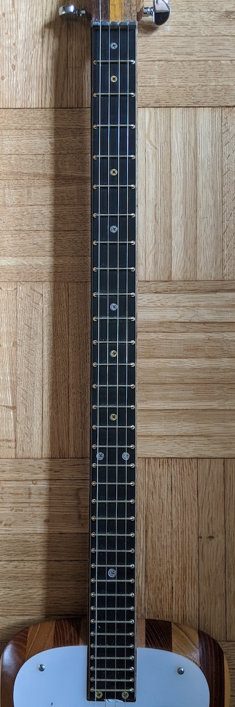
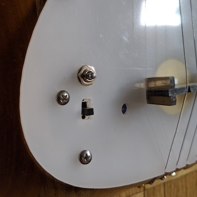
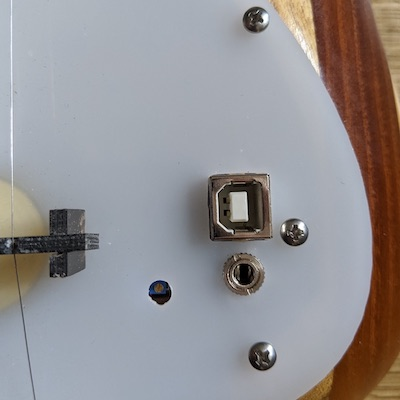

# Shtar

## About

The Shtar is an instrument by Shbobo.

The neck is marked, with neutral intervals in brass and power chords in steel. 33 frets control computer music, with heart transducer (sensing pressure) and bridge pickup. Two knobs aux Eurorack inputs. Three modes of production: acoustic; add computer music; multiply by computer music (stereo ring mod). USB interfaces to host as does the SHNTH. There is a red light. 

## Description with images

### Front

* 1 neck
* 4 strings
* 33 frets
* 6 silver screws for fret markers ()
* 6 steel screws for fret markers ()
* 2 piezos
* 2 eurorack input jacks
* 2 knobs (1 per eurorack input)
* 1 USB jack
* 1 audio stereo jack for output (TRS 1/8")

 

### Back

 

### Headstock

 

### Neck

 

### Lower Left

 

### Lower right

 

## Tuning

Back to tuning–the shtar shall divide the octave into seventeen equal parts, for 33 total frets. Fourths, fifths and octaves have the customary pearl marker as power spots. Neutral seconds and thirds also have a marker for modal playing. Three strings – a fifth for strumming and an octave for soli.

Rodrigo Costanzo tunes their Shtar in fourths, like a guitar. This enables us to use the same guitar fingering for octaves, as in, if you are playing a root note, its octave up is two strings up, two frets up. In the case of the Shtar it is approximately an octave.

## Shlisp

All the code and patches that run on a Shnth, can run on a guitar.

The Shtar has additional opcodes that won't work on a Shnth.

## Gwonzer

## Fretboard

The fretboard of the Shtar is a fret scanner.

The last fret of the Shtar, 33th, is the Tar button.

The brass screws correspond to one of the rows of buttons of the Shnth.

The silver screws correspond to the other row of buttons of the Shnth. 

## Bars

The equivalent to the 4 bars of the Shnth are the 2 Eurorack inputs / knobs,
and the 2 contact mics, one on each half of the fretboard.

## Modes

There are 3 modes:

* Acoustic sound
* Acoustic sound + electronics
* Acoustic sound + electronics + ring modulator

## Lights

When the Shtar is charging, both its green and red lights are on.

When the Shtar is on, the red light is on.

# Related instruments

[Namasitar](https://ciat-lonbarde.net/namastitar/index.html) by Peter Blasser.
